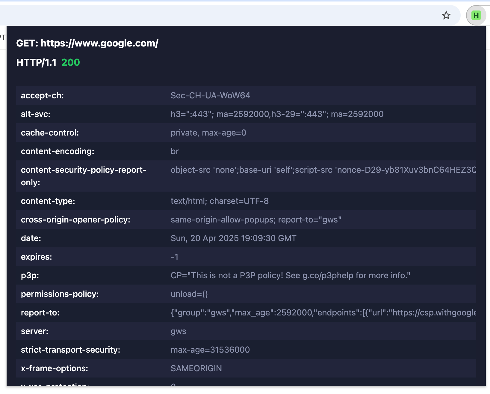
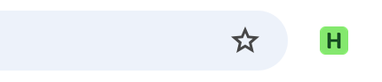

# HTTP Headers Viewer

A Chrome extension for viewing HTTP(S) headers with a minimal, elegant interface designed for developers and web professionals.

## Features

- **Minimal Dark Design**: Modern dark theme with high contrast colors for better readability
- **Status Code Badges**: Displays status codes directly on the extension icon for non-200 responses
- **Zebra-Striped Layout**: Alternating row backgrounds for easier header reading
- **No Text Wrapping**: Headers displayed without line wrapping with horizontal scrolling
- **Copy to Clipboard**: Click on any header to copy it instantly
- **Main Frame Focus**: Shows headers only for the main page request to avoid clutter
- **Auto Refresh**: Updates automatically when navigating between pages

## Screenshots




## Installation

### From Chrome Web Store

_(Coming soon)_

### Manual Installation (Developer Mode)

1. Clone or download this repository
2. Open Chrome and navigate to `chrome://extensions/`
3. Enable "Developer mode" (toggle in the top-right corner)
4. Click "Load unpacked" and select the `src` directory from this repository
5. The extension icon will appear in your browser toolbar

## Usage

1. Navigate to any website you want to inspect
2. The extension icon will show the status code (if not 200)
3. Click on the extension icon to open the detailed view
4. See all response headers in an easy-to-read format
5. Click on any header row to copy it to clipboard

For more detailed instructions, check the [documentation](docs/DOCUMENTATION.md).

## Privacy & Security

This extension:

- Only reads HTTP header information for the pages you visit
- Processes all data locally within your browser
- Does not transmit any data to external servers
- Does not track browsing history or collect personal information

For complete details, read our [Privacy Policy](docs/PRIVACY.md) and [Security Audit Report](docs/SECURITY_AUDIT.md).

## Project Structure

```
src/
├── background/     # Background scripts for header capture
├── content/        # Content scripts (minimal)
├── icons/          # Extension icons
├── popup/          # Popup UI files
└── styles/         # CSS stylesheets
```

## Development

1. Clone the repository
2. Make changes to the source code
3. Load the extension in developer mode
4. For major changes, please open an issue first

## License

MIT License - See the LICENSE file for details.

## Contributing

Contributions are welcome! Please feel free to submit a pull request or create an issue.
